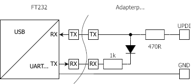
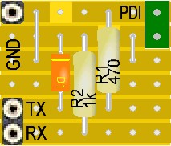
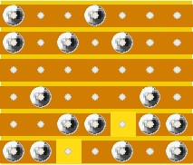
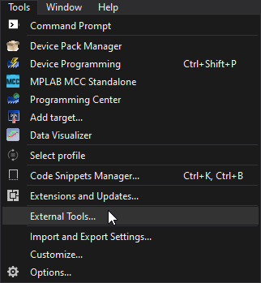
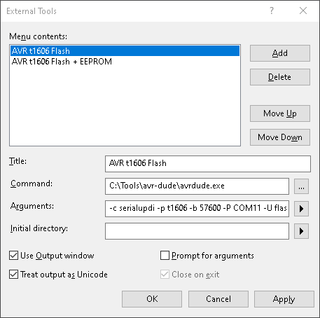
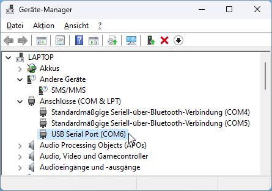
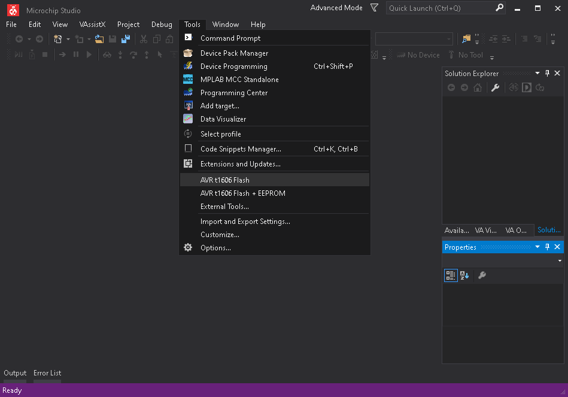

[](https://github.com/0x007e/tiny0)  [](https://www.gnu.org/licenses/gpl-3.0)

# ATTiny 0/1/2 series peripheral libraries 

This project includes some easy to use libraries. They can be found in the [library](./library/) directory. They are designed for the ATTiny 0/1/2 series for fast initializing `system clock`/`twi`/`uart`/`spi`/`analog` hardware parts of the ATTiny controllers. Every library has a `main.c` where a description how to use the library can be found.

---

# UPDI Programming with `avr-dude`

## Serial-UPDI Hardware

For Programming the device with `serialupdi` a `USB/UART` bridge is necessary and a simple adapter pcb. 

[USB/UART Bridge from RS-Components](https://at.rs-online.com/web/p/entwicklungstools-kommunikation-und-drahtlos/7916390?gb=s)



| Top       | Bottom  |
|:---------:|:-------:|
| |  |

## UPDI programming (over USB/UART) with Microchip Studio

Download Avr Dude [`avrdude-v?.?-windows-x64.zip`](https://www.microchip.com/mplab/avr-support/atmel-studio-7) and [Microchip Studio 7](https://www.microchip.com/mplab/avr-support/atmel-studio-7)

Copy avr-dude to a preferred path (e.g. `C:\Tools\avrdude`) and setup external tools in Microchip Studio 7.





``` bash
# Title
AVR Dude t1606 FLASH
# Command
C:\Tools\avrdude\avrdude.exe
# Arguments                      !PORT!
-c serialupdi -p t1606 -b 57600 -P COM? -U flash:w:"$(TargetDir)$(TargetName).hex":a -v

# Arguments
```

``` bash
# Title
AVR Dude t1606 FLASH + EEPROM
# Command
C:\Tools\avrdude\avrdude.exe
# Arguments                      !PORT!
-c serialupdi -p t1606 -b 57600 -P COM? -U flash:w:"$(TargetDir)$(TargetName).hex":a -U eeprom:w:"$(TargetDir)$(TargetName).eep":a -v

# Arguments
```

> Important: It is necessary to setup the right COM-Port!



Now projects can be programmed with `avr-dude` and `serialupdi` after the project was built.



---

## Software

Additional software that needs to be installed:

* [Microchip Studio 7](https://www.microchip.com/mplab/avr-support/atmel-studio-7)
* [TeraTerm](https://teratermproject.github.io/index-en.html)
* [AVRdude](https://github.com/avrdudes/avrdude/releases)

---

**R. GAECHTER**